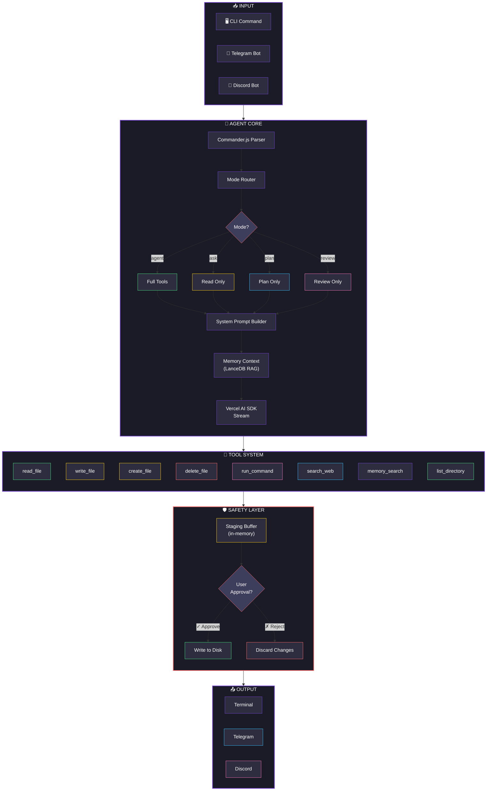
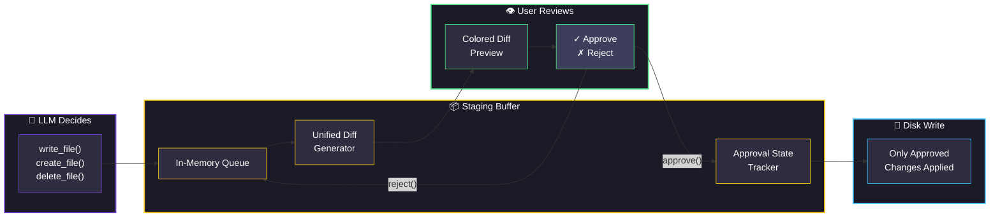
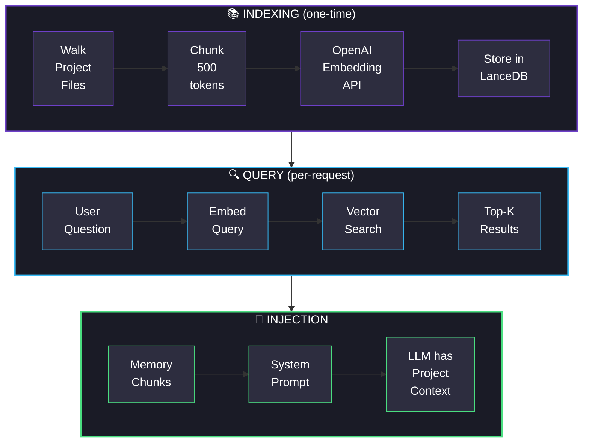
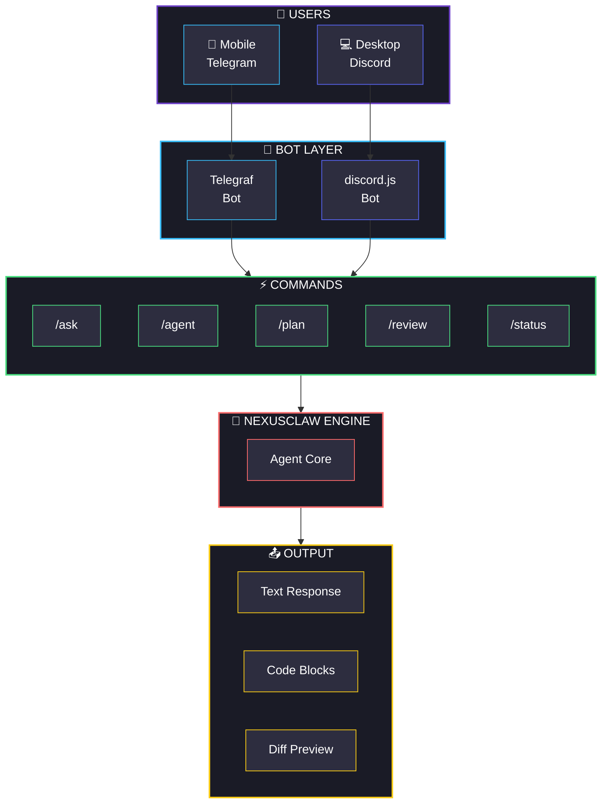
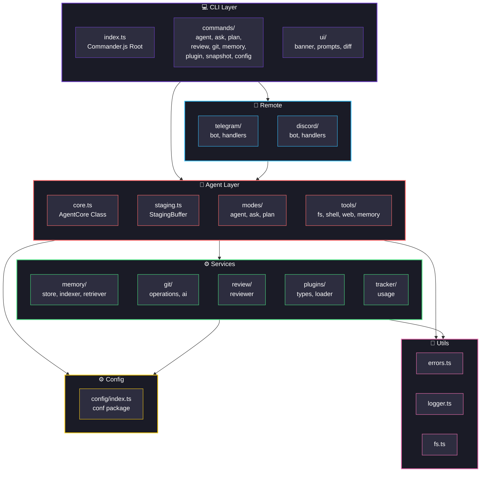
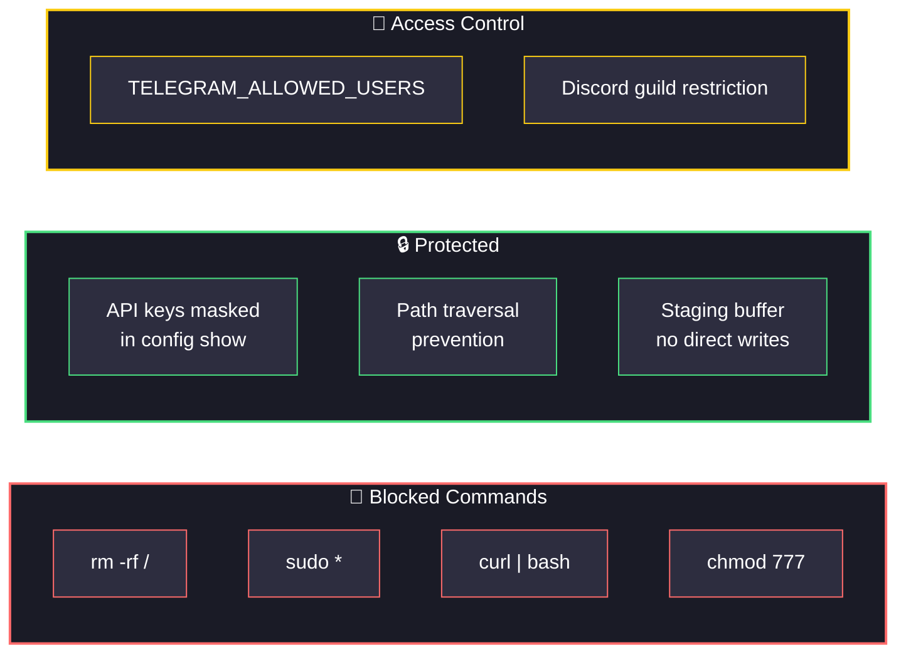

<p align="center">
  
</p>

<p align="center">
  <a href="#"></a>
  <a href="#"></a>
  <a href="#"></a>
  <a href="#"></a>
  <a href="#"></a>
</p>

<p align="center">
  
</p>

<br>

---

## 🎬 How It Works

### Execution Pipeline



### Staging Safety Flow



### Memory RAG Flow



### Git Automation Flow

```mermaid
flowchart TB
    subgraph Commit["📝 AI COMMIT"]
        direction LR
        G1["git diff\n--cached"] --> G2["Send to\nLLM"] --> G3["AI generates\nconventional\ncommit message"] --> G4{"User\napprove?"}
        G4 -->|"Yes"| G5["git commit"]
        G4 -->|"No"| G6["Cancel"]
    end

    subgraph PR["🔀 AI PR"]
        direction LR
        P1["git diff\n+\ngit log"] --> P2["AI generates\ntitle + body"] --> P3{"User\napprove?"}
        P3 -->|"Yes"| P4["git push\n+\ngh pr create"]
        P3 -->|"No"| P5["Cancel"]
    end

    subgraph Changelog["📋 AI CHANGELOG"]
        direction LR
        CL1["git log\n-50"] --> CL2["AI groups\nby type"] --> CL3["CHANGELOG.md"]
    end

    style Commit fill:#1a1b26,stroke:#6e40c9,stroke-width:2px,color:#fff
    style PR fill:#1a1b26,stroke:#4ade80,stroke-width:2px,color:#fff
    style Changelog fill:#1a1b26,stroke:#facc15,stroke-width:2px,color:#fff
    style G1 fill:#2d2d3f,stroke:#6e40c9,color:#fff
    style G2 fill:#2d2d3f,stroke:#6e40c9,color:#fff
    style G3 fill:#2d2d3f,stroke:#6e40c9,color:#fff
    style G4 fill:#3d3d5c,stroke:#ff6b6b,color:#fff
    style G5 fill:#2d2d3f,stroke:#4ade80,color:#fff
    style G6 fill:#2d2d3f,stroke:#ff6b6b,color:#fff
    style P1 fill:#2d2d3f,stroke:#4ade80,color:#fff
    style P2 fill:#2d2d3f,stroke:#4ade80,color:#fff
    style P3 fill:#3d3d5c,stroke:#ff6b6b,color:#fff
    style P4 fill:#2d2d3f,stroke:#4ade80,color:#fff
    style P5 fill:#2d2d3f,stroke:#ff6b6b,color:#fff
    style CL1 fill:#2d2d3f,stroke:#facc15,color:#fff
    style CL2 fill:#2d2d3f,stroke:#facc15,color:#fff
    style CL3 fill:#2d2d3f,stroke:#facc15,color:#fff
```



### Remote Control Architecture



---

## 🏗️ Architecture



---

## 🎯 Mode Comparison

| Feature | `agent` | `ask` | `plan` | `review` |
|:--------|:-------:|:-----:|:------:|:--------:|
| Read files | ✅ | ✅ | ✅ | ✅ |
| List directory | ✅ | ✅ | ✅ | ❌ |
| Write files | ⚠️ staged | ❌ | ❌ | ❌ |
| Create files | ⚠️ staged | ❌ | ❌ | ❌ |
| Delete files | ⚠️ staged | ❌ | ❌ | ❌ |
| Run commands | ✅ | ❌ | ❌ | ❌ |
| Web search | ✅ | ✅ | ❌ | ❌ |
| Memory search | ✅ | ❌ | ❌ | ❌ |
| Code analysis | ✅ | ✅ | ✅ | ✅ |
| Generate plan | ❌ | ❌ | ✅ | ❌ |
| Review code | ❌ | ❌ | ❌ | ✅ |

> ⚠️ = staged in buffer, requires user approval before writing to disk

---

## 🚀 Quick Start

### Prerequisites

1. **Bun** — JavaScript runtime
   ```bash
   curl -fsSL https://bun.sh/install | bash
   ```

2. **OpenRouter API key** (free tier)
   - Sign up at [openrouter.ai](https://openrouter.ai)
   - Create a key (starts with `sk-or-...`)

### Installation

```bash
git clone https://github.com/yourusername/nexusclaw.git
cd nexusclaw
bun install
bun run dev config set openrouter_api_key sk-or-YOUR_KEY
```

### First Commands

```bash
# Safe — read only
bun run dev ask "What files are here?"

# Plan — no execution
bun run dev plan "Add authentication"

# Agent — staged changes
bun run dev agent "Create Express server"

# Review — code analysis
bun run dev review src/index.ts
```

---

## 📖 Commands

### `nexusclaw agent <task>`

```bash
bun run dev agent "Fix the auth bug"           # Interactive approval
bun run dev agent "Fix the auth bug" --yes      # Auto-approve
bun run dev agent "Fix the auth bug" --dry-run  # Preview only
```

### `nexusclaw ask <query>`

```bash
bun run dev ask "How does auth work?"
bun run dev ask "Explain the code" --save explanation.md
```

### `nexusclaw plan <goal>`

```bash
bun run dev plan "Add WebSocket support"
```

### `nexusclaw review [file]`

```bash
bun run dev review src/auth.ts
bun run dev review --diff
```

### `nexusclaw git`

```bash
bun run dev git status
bun run dev git commit
bun run dev git pr
bun run dev git changelog
```

### `nexusclaw memory`

```bash
bun run dev memory init
bun run dev memory search "authentication"
bun run dev memory count
bun run dev memory clear
```

### `nexusclaw config`

```bash
bun run dev config show
bun run dev config set <key> <value>
bun run dev config reset
```

### `nexusclaw plugin`

```bash
bun run dev plugin add ./plugins/my-plugin.ts
bun run dev plugin list
bun run dev plugin remove my-plugin
```

### `nexusclaw snapshot`

```bash
bun run dev snapshot create
bun run dev snapshot load backup.nexus
```

---

## 🔌 Plugin Development

```typescript
// plugins/weather.plugin.ts
import { tool } from 'ai'
import { z } from 'zod'
import type { NexusClawPlugin } from '../src/plugins/types'

const weatherTool = tool({
  description: 'Get weather for a city',
  parameters: z.object({
    city: z.string(),
  }),
  execute: async ({ city }) => {
    return { city, temp: '22°C', condition: 'Sunny' }
  },
})

const plugin: NexusClawPlugin = {
  name: 'weather',
  version: '1.0.0',
  description: 'Weather lookup',
  tools: { get_weather: weatherTool },
}

export default plugin
```

```bash
bun run dev plugin add ./plugins/weather.plugin.ts
```

---

## 🤖 Remote Control

### Telegram

1. Message [@BotFather](https://t.me/BotFather) → `/newbot` → copy token
2. `bun run dev config set telegram_bot_token YOUR_TOKEN`
3. `bun run telegram`
4. Send `/ask`, `/agent`, `/plan`, `/review` to your bot

### Discord

1. [Developer Portal](https://discord.com/developers/applications) → New App → Bot → copy token
2. `bun run dev config set discord_bot_token YOUR_TOKEN`
3. `bun run dev config set discord_guild_id YOUR_SERVER_ID`
4. `bun run discord`
5. Use slash commands: `/ask`, `/agent`, `/plan`, `/status`

---

## 🛡️ Security



---

## 📊 Cost Tracking

| Model | Input / 1M tokens | Output / 1M tokens |
|:------|------------------:|--------------------:|
| gemini-flash-1.5 | $0.075 | $0.30 |
| gemini-pro-1.5 | $1.25 | $5.00 |
| claude-3.5-sonnet | $3.00 | $15.00 |
| claude-3-haiku | $0.25 | $1.25 |
| gpt-4o | $2.50 | $10.00 |
| gpt-4o-mini | $0.15 | $0.60 |

---

## 🧪 Tests

```
✅ staging.test.ts   — 12 tests
✅ git.test.ts       —  4 tests
✅ agent.test.ts     —  2 tests
✅ memory.test.ts    —  1 test
─────────────────────────────
   19 tests, 39 assertions, 0 failures
```

---

## 📄 License

MIT

<p align="center">
  
</p>
