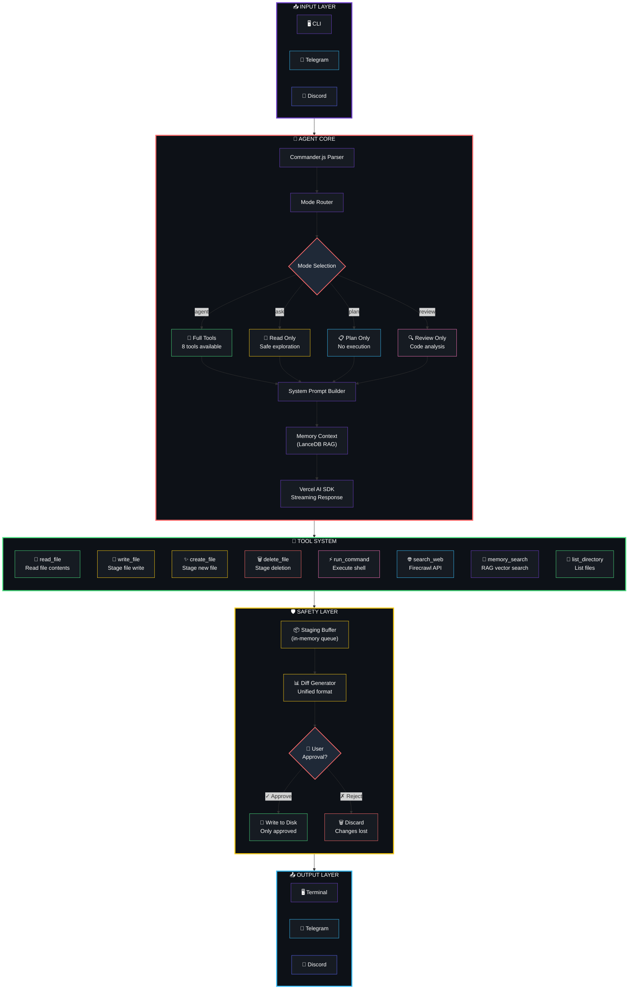
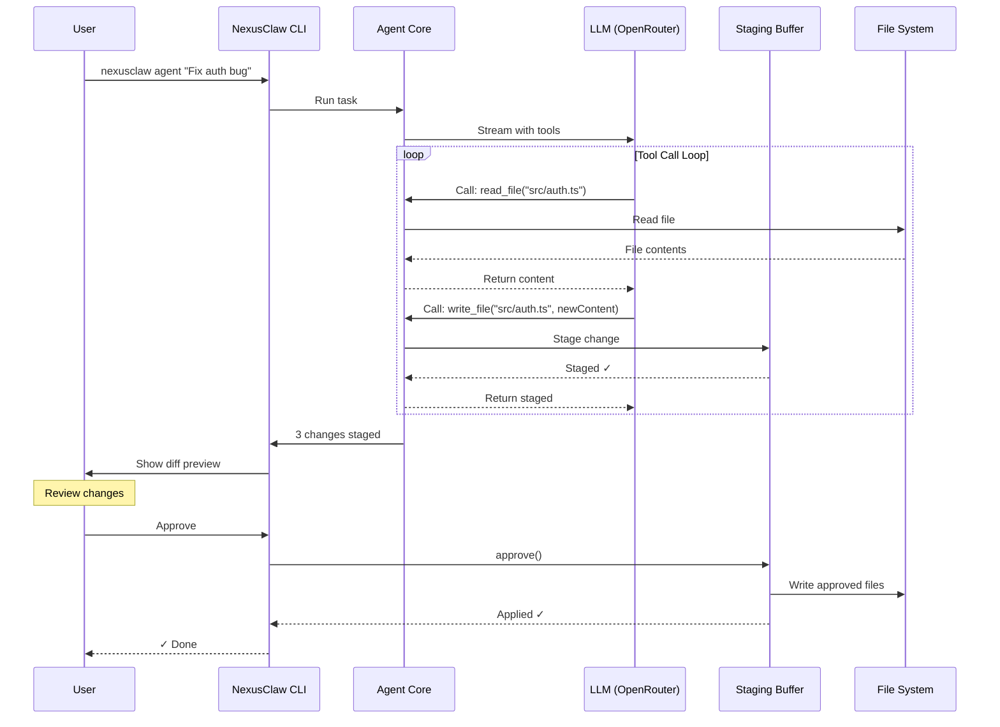
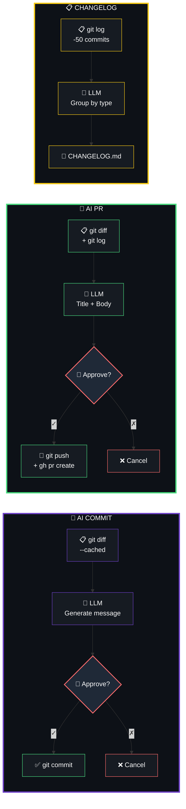
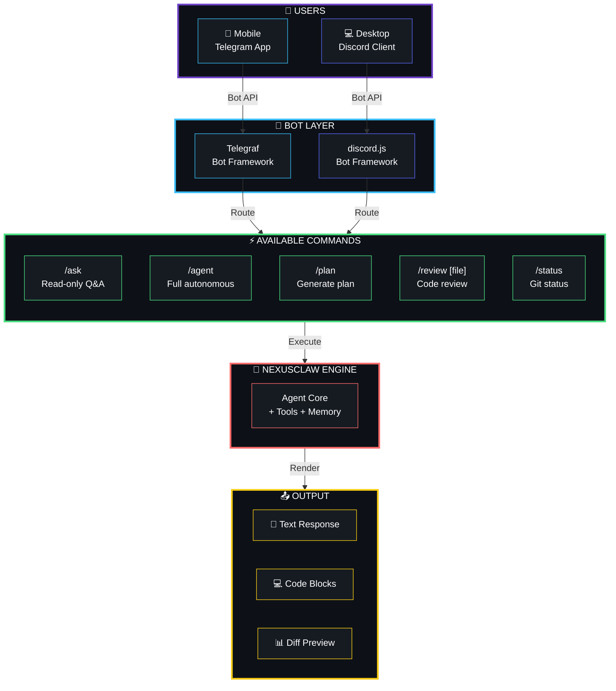
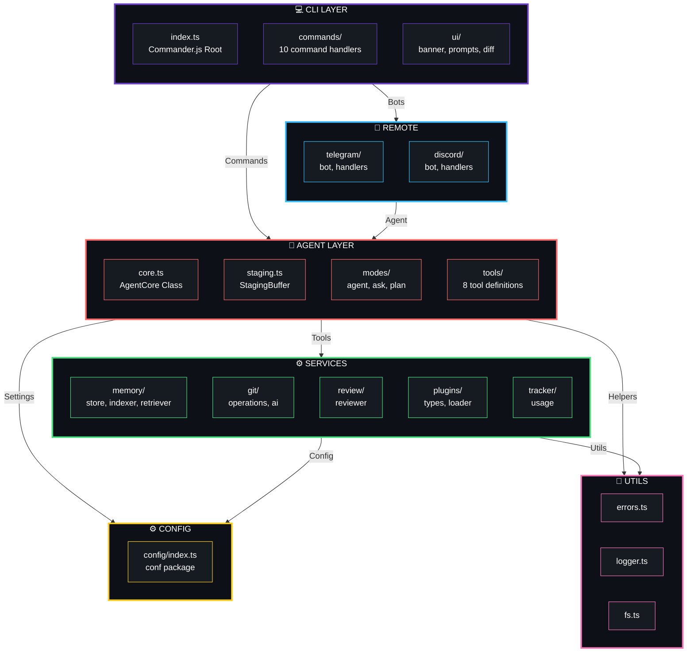
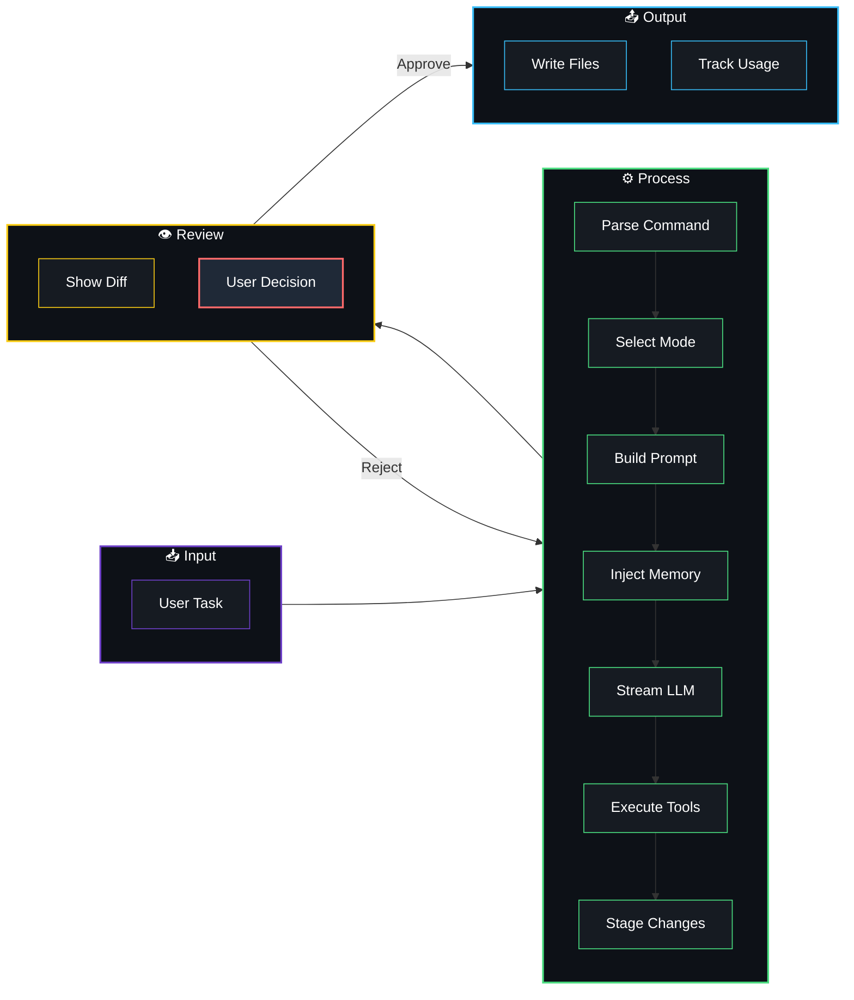
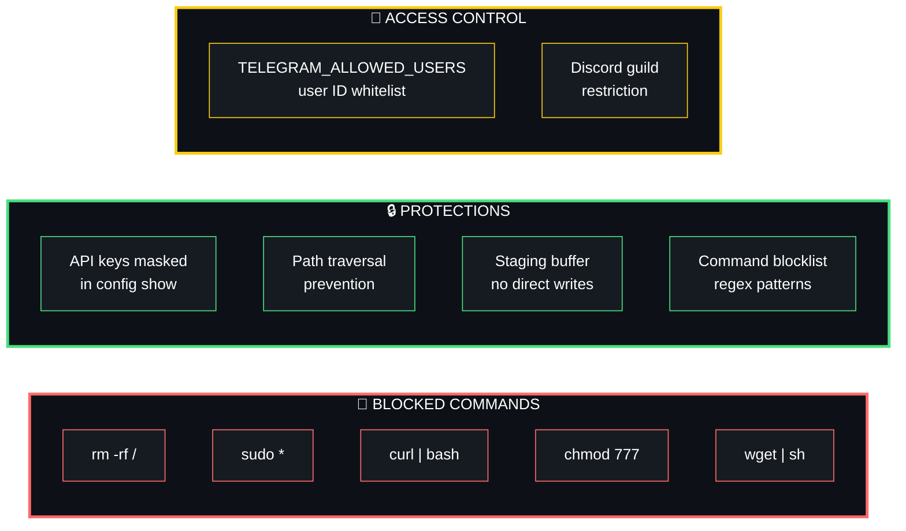

<p align="center">
  
</p>

<p align="center">
  <a href="#"></a>
  <a href="#"></a>
  <a href="#"></a>
  <a href="#"></a>
  <a href="#"></a>
  <a href="#"></a>
</p>

<p align="center">
  
</p>

<br>

<p align="center">
  <a href="#-features">Features</a> •
  <a href="#-how-it-works">How It Works</a> •
  <a href="#-quick-start">Quick Start</a> •
  <a href="#-commands">Commands</a> •
  <a href="#-architecture">Architecture</a> •
  <a href="#-plugins">Plugins</a> •
  <a href="#-remote-control">Remote Control</a> •
  <a href="#-security">Security</a> •
  <a href="#-contributing">Contributing</a>
</p>

<br>

---

## ✨ Features

<table>
<tr>
<td width="50%">

### 🤖 Autonomous Agent
Full tool access with staged mutations. Every file change requires your explicit approval before writing to disk.

</td>
<td width="50%">

### 🛡️ Safety First
Staging buffer pattern ensures no file is ever modified without your review. Unified diffs, approve/reject flow.

</td>
</tr>
<tr>
<td width="50%">

### 🧠 Memory RAG
LanceDB vector store with OpenAI embeddings. Your agent automatically has context about your entire project.

</td>
<td width="50%">

### 🔀 Git Automation
AI-generated commit messages, PR descriptions, and changelogs. Conventional commits, semantic versioning.

</td>
</tr>
<tr>
<td width="50%">

### 📱 Remote Control
Control your agent from Telegram or Discord. Run commands, review changes, approve/reject from your phone.

</td>
<td width="50%">

### 🔌 Plugin System
Extend NexusClaw with custom tools. Write TypeScript plugins that add new capabilities to the agent.

</td>
</tr>
<tr>
<td width="50%">

### 📊 Cost Tracking
Per-session token counting with model-based pricing. Know exactly what each operation costs.

</td>
<td width="50%">

### 🔍 Code Review
AI-powered code review with severity levels: CRITICAL, WARNING, INFO. Review files or diffs.

</td>
</tr>
<tr>
<td width="50%">

### 💬 Interactive Chat
Chat mode with persistent conversation history. Switch modes on the fly, review and approve changes inline.

</td>
<td width="50%">

### 🔧 Extensible
Plugin system lets you add custom tools. Weather, database, API integrations — anything you can code.

</td>
</tr>
</table>

<br>

---

## 🎬 How It Works

### Terminal Demo

<!-- Animated terminal demo -->
<p align="center">
  
</p>

```bash
$ nexusclaw agent "Create a REST API with Express and TypeScript"

  ███╗   ██╗███████╗██╗  ██╗██╗   ██╗███████╗ ██████╗██╗      █████╗ ██╗    ██╗
  ████╗  ██║██╔════╝╚██╗██╔╝██║   ██║██╔════╝██╔════╝██║     ██╔══██╗██║    ██║
  ██╔██╗ ██║█████╗   ╚███╔╝ ██║   ██║███████╗██║     ██║     ███████║██║ █╗ ██║
  ██║╚██╗██║██╔══╝   ██╔██╗ ██║   ██║╚════██║██║     ██║     ██╔══██║██║███╗██║
  ██║ ╚████║███████╗██╔╝ ██╗╚██████╔╝███████║╚██████╗███████╗██║  ██║╚███╔███╔╝
  ╚═╝  ╚═══╝╚══════╝╚═╝  ╚═╝ ╚═════╝ ╚══════╝ ╚═════╝╚══════╝╚═╝  ╚═╝ ╚══╝╚══╝

  ✓ Agent is working...

  I'll create a REST API with Express and TypeScript. Let me set up the project structure.

  [Tool: create_file] src/index.ts
  [Tool: create_file] src/routes/users.ts
  [Tool: create_file] src/routes/health.ts
  [Tool: create_file] src/middleware/errorHandler.ts
  [Tool: write_file]  package.json
  [Tool: write_file]  tsconfig.json

  ✓ Agent finished

  ─── Proposed Changes ────────────────────────────────────────────

    ✓ approved  CREATE   src/index.ts
    ○ pending   CREATE   src/routes/users.ts
    ○ pending   CREATE   src/routes/health.ts
    ○ pending   CREATE   src/middleware/errorHandler.ts
    ○ pending   MODIFY   package.json
    ○ pending   MODIFY   tsconfig.json

  ─── Unified Diff ────────────────────────────────────────────────

  --- /dev/null
  +++ src/index.ts
  @@ -0,0 +1,25 @@
  +import express from 'express';
  +import { errorHandler } from './middleware/errorHandler';
  +import { userRoutes } from './routes/users';
  +import { healthRoutes } from './routes/health';
  +
  +const app = express();
  +const PORT = process.env.PORT || 3000;
  +
  +app.use(express.json());
  +app.use('/api/users', userRoutes);
  +app.use('/api/health', healthRoutes);
  +app.use(errorHandler);
  +
  +app.listen(PORT, () => {
  +  console.log(`Server running on port ${PORT}`);
  +});
  +
  ─────────────────────────────────────────────────────────────────

  Apply these changes? › Yes / No
  › Yes

  ✓ src/index.ts written
  ✓ src/routes/users.ts written
  ✓ src/routes/health.ts written
  ✓ src/middleware/errorHandler.ts written
  ✓ package.json written
  ✓ tsconfig.json written

  ✓ Done
```

<br>

### Execution Pipeline



<br>

### Staging Safety Flow



<br>

### Memory RAG System

```mermaid
flowchart TB
    subgraph Index["📚 INDEXING PHASE (One-time)"]
        direction TB
        I1["🔍 Walk Project\nDirectory"] --> I2["📄 Filter Files\n.ts .js .md .py .go"]
        I2 --> I3["✂️ Chunk Text\n500 tokens, 50 overlap"]
        I3 --> I4["🧮 OpenAI API\ntext-embedding-3-small"]
        I4 --> I5["💾 LanceDB Store\n.nexusclaw/memory/"]
    end

    subgraph Query["🔍 QUERY PHASE (Per-request)"]
        direction TB
        Q1["❓ User Question"] --> Q2["🧮 Embed Query\nOpenAI API"]
        Q2 --> Q3["🔎 Vector Search\nCosine Similarity"]
        Q3 --> Q4["📊 Top-K Results\nDefault: 5 chunks"]
    end

    subgraph Inject["💉 INJECTION PHASE"]
        direction TB
        N1["📝 Memory Chunks"] --> N2["🎯 System Prompt\nContext Section"]
        N2 --> N3["🤖 LLM Response\nWith Project Context"]
    end

    Index -->|"Store vectors"| Query
    Query -->|"Relevant chunks"| Inject

    style Index fill:#0d1117,stroke:#6e40c9,stroke-width:3px,color:#fff
    style Query fill:#0d1117,stroke:#38bdf8,stroke-width:3px,color:#fff
    style Inject fill:#0d1117,stroke:#4ade80,stroke-width:3px,color:#fff
    style I1 fill:#161b22,stroke:#6e40c9,color:#fff
    style I2 fill:#161b22,stroke:#6e40c9,color:#fff
    style I3 fill:#161b22,stroke:#6e40c9,color:#fff
    style I4 fill:#161b22,stroke:#6e40c9,color:#fff
    style I5 fill:#161b22,stroke:#6e40c9,color:#fff
    style Q1 fill:#161b22,stroke:#38bdf8,color:#fff
    style Q2 fill:#161b22,stroke:#38bdf8,color:#fff
    style Q3 fill:#161b22,stroke:#38bdf8,color:#fff
    style Q4 fill:#161b22,stroke:#38bdf8,color:#fff
    style N1 fill:#161b22,stroke:#4ade80,color:#fff
    style N2 fill:#161b22,stroke:#4ade80,color:#fff
    style N3 fill:#161b22,stroke:#4ade80,color:#fff
```



<br>

### Git Automation



<br>

### Remote Control Architecture



<br>

---

## 🏗️ Architecture

### System Architecture



### Data Flow



<br>

### Project Structure

```
nexusclaw/
├── 📦 package.json                    # Dependencies & scripts
├── ⚙️ tsconfig.json                   # TypeScript strict config
├── 🔧 bunfig.toml                    # Bun runtime config
│
├── src/
│   ├── 📁 config/                    # Configuration
│   │   └── index.ts                  # Persistent config via `conf`
│   │
│   ├── 📁 utils/                     # Utilities
│   │   ├── errors.ts                 # ClawError class
│   │   ├── logger.ts                 # Chalk logging
│   │   └── fs.ts                     # Path safety
│   │
│   ├── 📁 agent/                     # 🧠 Core Engine
│   │   ├── core.ts                   # AgentCore class
│   │   ├── staging.ts                # StagingBuffer
│   │   ├── 📁 modes/                 # Mode implementations
│   │   └── 📁 tools/                 # 8 tool definitions
│   │
│   ├── 📁 memory/                    # 🧠 RAG System
│   │   ├── store.ts                  # LanceDB wrapper
│   │   ├── indexer.ts                # Chunking + embedding
│   │   └── retriever.ts              # Vector search
│   │
│   ├── 📁 git/                       # 🔀 Git Automation
│   │   ├── operations.ts             # simple-git wrappers
│   │   └── ai.ts                     # AI commit/PR/changelog
│   │
│   ├── 📁 review/                    # 🔍 Code Review
│   │   └── reviewer.ts               # File/diff analysis
│   │
│   ├── 📁 cli/                       # 💻 CLI Interface
│   │   ├── index.ts                  # Commander.js root
│   │   ├── 📁 ui/                    # Terminal UI
│   │   └── 📁 commands/              # 10 commands (incl. chat)
│   │
│   ├── 📁 remote/                    # 🤖 Remote Control
│   │   ├── 📁 telegram/              # Telegram bot
│   │   └── 📁 discord/               # Discord bot
│   │
│   ├── 📁 plugins/                   # 🔌 Plugin System
│   │   ├── types.ts                  # Plugin interface
│   │   └── loader.ts                 # Dynamic loader
│   │
│   └── 📁 tracker/                   # 📊 Usage Tracking
│       └── usage.ts                  # Token + cost
│
├── 📁 tests/                         # 🧪 Test Suite
│   ├── staging.test.ts               # 12 tests
│   ├── git.test.ts                   # 4 tests
│   ├── agent.test.ts                 # 2 tests
│   └── memory.test.ts                # 1 test
│
└── 📁 plugins/                       # User plugins
```

---

## 🎯 Mode Comparison

<table>
<tr>
<th>Capability</th>
<th><code>agent</code></th>
<th><code>ask</code></th>
<th><code>plan</code></th>
<th><code>review</code></th>
</tr>
<tr>
<td>Read files</td>
<td align="center">✅</td>
<td align="center">✅</td>
<td align="center">✅</td>
<td align="center">✅</td>
</tr>
<tr>
<td>List directory</td>
<td align="center">✅</td>
<td align="center">✅</td>
<td align="center">✅</td>
<td align="center">❌</td>
</tr>
<tr>
<td>Write files</td>
<td align="center">⚠️ staged</td>
<td align="center">❌</td>
<td align="center">❌</td>
<td align="center">❌</td>
</tr>
<tr>
<td>Create files</td>
<td align="center">⚠️ staged</td>
<td align="center">❌</td>
<td align="center">❌</td>
<td align="center">❌</td>
</tr>
<tr>
<td>Delete files</td>
<td align="center">⚠️ staged</td>
<td align="center">❌</td>
<td align="center">❌</td>
<td align="center">❌</td>
</tr>
<tr>
<td>Run commands</td>
<td align="center">✅</td>
<td align="center">❌</td>
<td align="center">❌</td>
<td align="center">❌</td>
</tr>
<tr>
<td>Web search</td>
<td align="center">✅</td>
<td align="center">✅</td>
<td align="center">❌</td>
<td align="center">❌</td>
</tr>
<tr>
<td>Memory search</td>
<td align="center">✅</td>
<td align="center">❌</td>
<td align="center">❌</td>
<td align="center">❌</td>
</tr>
<tr>
<td>Code analysis</td>
<td align="center">✅</td>
<td align="center">✅</td>
<td align="center">✅</td>
<td align="center">✅</td>
</tr>
<tr>
<td>Generate plan</td>
<td align="center">❌</td>
<td align="center">❌</td>
<td align="center">✅</td>
<td align="center">❌</td>
</tr>
<tr>
<td>Review code</td>
<td align="center">❌</td>
<td align="center">❌</td>
<td align="center">❌</td>
<td align="center">✅</td>
</tr>
</table>

> ⚠️ **Staged** = changes are held in memory buffer, require explicit user approval before writing to disk

---

## 🚀 Quick Start

### Prerequisites

<table>
<tr>
<td width="50%">

**1. Bun Runtime**

```bash
# macOS / Linux
curl -fsSL https://bun.sh/install | bash

# Windows (WSL)
powershell -c "irm bun.sh/install.ps1 | iex"

# Verify
bun --version
```

</td>
<td width="50%">

**2. OpenRouter API Key**

1. Go to [openrouter.ai](https://openrouter.ai)
2. Sign up (free tier available)
3. Navigate to **Keys** → **Create Key**
4. Copy key (starts with `sk-or-...`)

</td>
</tr>
</table>

### Installation

**Option 1: npm/npx (Recommended)**

```bash
# Install globally
npm install -g nexusclaw

# Or run directly with npx (no install needed)
npx nexusclaw ask "What files are here?"

# Configure your API key
nexusclaw config set openrouter_api_key sk-or-YOUR_KEY
```

**Option 2: From Source (Development)**

```bash
# Clone repository
git clone https://github.com/soumyachk101/NexusClaw.git
cd nexusclaw

# Install dependencies
bun install

# Configure API key
bun run dev config set openrouter_api_key sk-or-YOUR_KEY_HERE

# Verify installation
bun run dev -- --help
```

### First Commands

```bash
# If installed via npm/npx:
nexusclaw ask "What files are in this directory?"
nexusclaw plan "Add user authentication"
nexusclaw agent "Create a REST API"
nexusclaw chat

# If running from source:
bun run dev ask "What files are in this directory?"

# Generate a plan (no execution)
bun run dev plan "Add user authentication with JWT"

# Run agent (staged changes)
bun run dev agent "Create a REST API with Express"

# Review code
bun run dev review src/index.ts
```

---

## 📖 Commands

### `nexusclaw agent <task>`

Run autonomous agent with full tool access. All file changes are staged.

```bash
bun run dev agent "Fix the authentication bug"
bun run dev agent "Add input validation" --yes          # Auto-approve
bun run dev agent "Refactor database layer" --dry-run   # Preview only
```

| Option | Description |
|:-------|:------------|
| `-y, --yes` | Auto-approve all changes |
| `-d, --dry-run` | Show diff without applying |

---

### `nexusclaw chat`

Interactive chat mode with persistent conversation history. Chat with the AI agent in real-time.

```bash
bun run dev chat                          # Start chat (default: ask mode)
bun run dev chat -m agent                 # Start in agent mode
bun run dev chat -m plan                  # Start in plan mode
bun run dev chat -s "You are a senior dev"  # Custom system prompt
```

**Chat Commands:**
```
/mode <agent|ask|plan|review>   Switch mode on the fly
/diff                          Show staged changes diff
/approve                       Approve all staged changes
/reject                        Reject all staged changes
/clear                         Clear chat history
/exit                          Exit chat
/help                          Show available commands
```

| Option | Description |
|:-------|:------------|
| `-m, --mode <mode>` | Initial mode (default: ask) |
| `-s, --system <prompt>` | Custom system prompt |

---

### `nexusclaw ask <query>`

Read-only Q&A mode. Safe for exploration.

```bash
bun run dev ask "How does the StagingBuffer work?"
bun run dev ask "Explain the error handling" --save explanation.md
```

| Option | Description |
|:-------|:------------|
| `-s, --save <path>` | Save output to file |

---

### `nexusclaw plan <goal>`

Generate step-by-step plan. No execution.

```bash
bun run dev plan "Add WebSocket support for real-time updates"
bun run dev plan "Migrate from REST to GraphQL"
```

---

### `nexusclaw review [file]`

AI code review with severity levels.

```bash
bun run dev review src/auth.ts              # Review file
bun run dev review --diff                   # Review staged changes
bun run dev review --diff HEAD~1            # Review since ref
```

| Option | Description |
|:-------|:------------|
| `--diff [ref]` | Review diff (staged or since ref) |

---

### `nexusclaw git [subcommand]`

Git automation with AI.

```bash
bun run dev git status                      # Show status
bun run dev git commit                      # AI commit message
bun run dev git commit -m "my message"      # Manual message
bun run dev git branch feature-name         # Create branch
bun run dev git pr                          # Push + create PR
bun run dev git changelog                   # Generate changelog
```

---

### `nexusclaw memory [subcommand]`

Manage RAG memory system.

```bash
bun run dev memory init                     # Index project
bun run dev memory search "authentication"  # Search memory
bun run dev memory count                    # Show count
bun run dev memory clear                    # Clear data
```

---

### `nexusclaw config [subcommand]`

Manage configuration.

```bash
bun run dev config show                     # Show all (masked)
bun run dev config set <key> <value>        # Set value
bun run dev config reset                    # Reset defaults
```

<details>
<summary><strong>All Configuration Keys</strong></summary>

| Key | Type | Default | Description |
|:----|:-----|:--------|:------------|
| `model` | string | `google/gemini-flash-1.5` | LLM model |
| `openrouter_api_key` | string | — | OpenRouter key (required) |
| `openai_api_key` | string | — | OpenAI key (embeddings) |
| `firecrawl_api_key` | string | — | Firecrawl key (web search) |
| `telegram_bot_token` | string | — | Telegram bot token |
| `discord_bot_token` | string | — | Discord bot token |
| `discord_guild_id` | string | — | Discord server ID |
| `memory_enabled` | boolean | `true` | Enable RAG |
| `token_tracking` | boolean | `true` | Track usage |
| `max_agent_iterations` | number | `20` | Max tool loops |
| `safe_mode` | boolean | `true` | Block dangerous commands |

</details>

---

### `nexusclaw plugin [subcommand]`

Manage plugins.

```bash
bun run dev plugin add ./plugins/my-plugin.ts
bun run dev plugin list
bun run dev plugin remove my-plugin
```

---

### `nexusclaw snapshot [subcommand]`

Project snapshots for sharing.

```bash
bun run dev snapshot create
bun run dev snapshot create -o backup.nexus
bun run dev snapshot load backup.nexus
```

---

## 🔌 Plugins

Create custom tools by writing TypeScript plugins:

```typescript
// plugins/weather.plugin.ts
import { tool } from 'ai'
import { z } from 'zod'
import type { NexusClawPlugin } from '../src/plugins/types'

const weatherTool = tool({
  description: 'Get current weather for a city',
  parameters: z.object({
    city: z.string().describe('City name'),
  }),
  execute: async ({ city }) => {
    // Your implementation
    return { city, temp: '22°C', condition: 'Sunny' }
  },
})

const plugin: NexusClawPlugin = {
  name: 'weather',
  version: '1.0.0',
  description: 'Weather lookup tool',
  tools: { get_weather: weatherTool },
  onLoad: async () => console.log('Plugin loaded'),
  onUnload: async () => console.log('Plugin unloaded'),
}

export default plugin
```

```bash
# Load plugin
bun run dev plugin add ./plugins/weather.plugin.ts

# Use it
bun run dev ask "What's the weather in Tokyo?"

# Manage
bun run dev plugin list
bun run dev plugin remove weather
```

---

## 🤖 Remote Control

### Telegram Bot

<table>
<tr>
<td width="50%">

**Setup**

1. Message [@BotFather](https://t.me/BotFather)
2. Send `/newbot` → follow prompts
3. Copy bot token
4. Configure:
   ```bash
   bun run dev config set telegram_bot_token YOUR_TOKEN
   ```
5. Run:
   ```bash
   bun run telegram
   ```

</td>
<td width="50%">

**Commands**

```
/ask <query>        Read-only Q&A
/agent <task>       Full autonomous
/plan <goal>        Generate plan
/review [file]      Code review
/status             Git status
```

**Security**
```bash
# Restrict access by user ID
export TELEGRAM_ALLOWED_USERS=123456,789012
```

</td>
</tr>
</table>

### Discord Bot

<table>
<tr>
<td width="50%">

**Setup**

1. [Developer Portal](https://discord.com/developers/applications)
2. New Application → Bot → Copy token
3. Enable "Message Content Intent"
4. Configure:
   ```bash
   bun run dev config set discord_bot_token YOUR_TOKEN
   bun run dev config set discord_guild_id YOUR_SERVER_ID
   ```
5. Run:
   ```bash
   bun run discord
   ```

</td>
<td width="50%">

**Slash Commands**

```
/ask query:<text>       Read-only Q&A
/agent task:<text>      Full autonomous
/plan goal:<text>       Generate plan
/review file:<path>     Code review
/status                 Git status
```

</td>
</tr>
</table>

---

## 🛡️ Security



### Security Features

- **Command Blocklist**: Dangerous commands (`rm -rf /`, `sudo`, `curl | bash`) are automatically blocked
- **Path Traversal Prevention**: All file operations validated against workspace root
- **API Key Protection**: Keys stored in `~/.nexusclaw/`, masked in output, never sent to LLM
- **Staging Buffer**: No file mutation hits disk without explicit user approval
- **Access Control**: Telegram/Discord bots support user ID whitelisting

---

## 📊 Cost Tracking

### Supported Models

| Model | Input / 1M tokens | Output / 1M tokens | Best For |
|:------|------------------:|--------------------:|:---------|
| `google/gemini-flash-1.5` | $0.075 | $0.30 | Fast, cheap tasks |
| `google/gemini-pro-1.5` | $1.25 | $5.00 | Balanced |
| `anthropic/claude-3.5-sonnet` | $3.00 | $15.00 | Complex reasoning |
| `anthropic/claude-3-haiku` | $0.25 | $1.25 | Quick responses |
| `openai/gpt-4o` | $2.50 | $10.00 | General purpose |
| `openai/gpt-4o-mini` | $0.15 | $0.60 | Budget friendly |

### Usage Output

```
Tokens: 1,234 in / 567 out
Model: google/gemini-flash-1.5
Cost: $0.0003
```

View usage: `cat .nexusclaw/usage.json`

---

## 🔨 Building & Publishing

### Build Commands

```bash
# Build for Node.js (npm publish)
bun run build

# Build standalone binary
bun run build:binary

# Build both
bun run build:all
```

### npm Publishing

```bash
# 1. Login to npm
npm login

# 2. Build the project
bun run build:all

# 3. Publish
npm publish

# Users can now install with:
npm install -g nexusclaw

# Or run directly:
npx nexusclaw ask "Hello!"
```

### Project Structure (Build)

```
nexusclaw/
├── bin/
│   ├── nexusclaw.js          # npx entry point
│   └── nexusclaw             # Compiled binary (109MB)
├── dist/
│   └── cli/
│       └── index.js          # Node.js bundle (3MB)
└── package.json              # npm configuration
```

---

## 🧪 Tests

```
✅ staging.test.ts   — 12 tests  (StagingBuffer operations)
✅ git.test.ts       —  4 tests  (Git operations)
✅ agent.test.ts     —  2 tests  (ClawError, config shape)
✅ memory.test.ts    —  1 test   (Memory entry shape)
────────────────────────────────────────────────────────────
   19 tests, 39 assertions, 0 failures
```

```bash
# Run tests
bun test

# Run specific file
bun test tests/staging.test.ts

# Verbose output
bun test --verbose
```

---

## 🔧 Troubleshooting

| Error | Solution |
|:------|:---------|
| `OpenRouter API key not configured` | `bun run dev config set openrouter_api_key sk-or-...` |
| `Memory store not initialized` | `bun run dev memory init` |
| `OpenAI API key required` | `bun run dev config set openai_api_key sk-...` |
| TypeScript errors | `bun install && bun run lint` |
| Tests failing | `bun install && bun test` |

---

## 🤝 Contributing

```bash
# 1. Fork and clone
git clone https://github.com/soumyachk101/NexusClaw.git
cd nexusclaw

# 2. Create feature branch
bun run dev git branch my-feature

# 3. Make changes
# ... edit files ...

# 4. Run tests
bun test
bun run lint

# 5. Commit
bun run dev git commit

# 6. Push and create PR
bun run dev git pr
```

### Development Guidelines

- TypeScript strict mode (`noUncheckedIndexedAccess: true`)
- No `any` types (except for LLM SDK compatibility)
- All tool returns must be serializable
- Tests required for new features
- Conventional commits (`feat:`, `fix:`, `refactor:`, etc.)

---

## 📄 License

MIT License — see [LICENSE](LICENSE) for details.

---

<p align="center">
  
</p>

<p align="center">
  <strong>Built with ❤️ using Bun, TypeScript, and Vercel AI SDK</strong>
</p>
